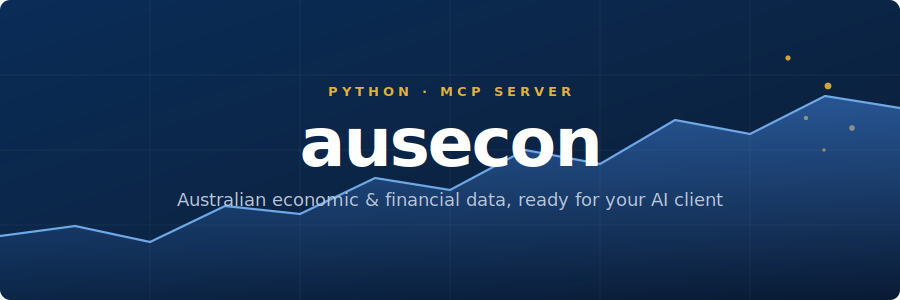

<div align="center">



<br/>

[](https://github.com/AnthonyPuggs/ausecon-mcp-server/actions)
[](https://pypi.org/project/ausecon-mcp-server/)
[](https://pypi.org/project/ausecon-mcp-server/)
[](#connect-your-client)
[](LICENSE)
[](https://smithery.ai/servers/anthonypuggs/ausecon-mcp)

<p>
  <b>ausecon</b> is a Model Context Protocol server that gives any AI assistant clean, structured
  access to Australia&rsquo;s core economic and financial data &mdash; straight from the
  <b>ABS</b>, <b>RBA</b>, and <b>APRA</b>.
</p>

<a href="https://auseconmcp.com"><b>Documentation</b></a> &nbsp;·&nbsp;
<a href="https://auseconmcp.com/getting-started">Getting started</a> &nbsp;·&nbsp;
<a href="https://auseconmcp.com/tools">Tool reference</a> &nbsp;·&nbsp;
<a href="https://github.com/AnthonyPuggs/ausecon-mcp-server/blob/main/CHANGELOG.md">Changelog</a>

</div>

---

## Why this exists

Australian economic data is authoritative but awkward to reach &mdash; different portals, different
formats, and identifiers you have to memorise. **ausecon** puts a friendly, consistent layer in
front of all three regulators so you (or your AI agent) can just ask for *&ldquo;the cash rate&rdquo;*
or *&ldquo;quarterly real GDP growth&rdquo;* and get back tidy, source-traceable series &mdash;
without leaving the conversation.

<table align="center">
  <tr>
    <td align="center"><b>14</b><br/><sub>read-only tools</sub></td>
    <td align="center"><b>75</b><br/><sub>economic concepts</sub></td>
    <td align="center"><b>16</b><br/><sub>derived indicators</sub></td>
    <td align="center"><b>8</b><br/><sub>prompt templates</sub></td>
    <td align="center"><b>3</b><br/><sub>data sources</sub></td>
  </tr>
</table>

## What you get

<table>
  <tr>
    <td width="33%" valign="top">
      <h4>🔎 Ask in plain English</h4>
      Discover concepts with <code>list_economic_concepts</code>, then pull resolved series by
      name &mdash; no dataset IDs required.
    </td>
    <td width="33%" valign="top">
      <h4>🧱 Three sources, one shape</h4>
      ABS, RBA and APRA all return the same tidy
      <code>metadata · series · observations</code> structure.
    </td>
    <td width="33%" valign="top">
      <h4>🧮 Transparent derived series</h4>
      Formula-based indicators like <code>real_cash_rate</code> &mdash; every calculation is
      open and inspectable.
    </td>
  </tr>
  <tr>
    <td width="33%" valign="top">
      <h4>🎯 Source-native control</h4>
      Drop down to raw <code>get_abs_data</code>, <code>get_rba_table</code> or
      <code>get_apra_data</code> whenever you need exact control.
    </td>
    <td width="33%" valign="top">
      <h4>⚡ Quick-turn helpers</h4>
      Convenience tools for latest observations, top movers and release events &mdash; analysis in
      one call.
    </td>
    <td width="33%" valign="top">
      <h4>🔌 Plugs into your client</h4>
      Claude Desktop, Claude Code, Cursor, Windsurf, VS Code, Codex or Smithery.
      stdio locally, Streamable HTTP when hosted.
    </td>
  </tr>
</table>

## Data sources

| Source | Coverage |
| :----- | :------- |
| **ABS** &nbsp;·&nbsp; Australian Bureau of Statistics | National accounts, prices, labour force, population |
| **RBA** &nbsp;·&nbsp; Reserve Bank of Australia | Cash rate, monetary & financial aggregates, exchange rates |
| **APRA** &nbsp;·&nbsp; Aust. Prudential Regulation Authority | ADI & insurer statistics, with release-cadence estimates |

## Try it instantly (no install)

Prefer not to install anything? A hosted, **read-only, no-API-key** instance speaks MCP over
Streamable HTTP at:

```text
https://ausecon-mcp-server.onrender.com/mcp
```

Point any MCP client that supports remote (Streamable HTTP) servers at that URL — for example, in
Claude Code:

```bash
claude mcp add --transport http ausecon https://ausecon-mcp-server.onrender.com/mcp
```

> The hosted instance may take a few seconds to wake on the first request.

## Install

The package lives on [PyPI](https://pypi.org/project/ausecon-mcp-server/) and is designed to be
launched on demand by your MCP client via [`uvx`](https://docs.astral.sh/uv/):

```bash
uvx ausecon-mcp-server
```

The server speaks MCP over standard input/output. Launched on its own, it simply waits for a client
to connect.

## Connect your client

<details open>
<summary><b>Claude Desktop</b></summary>

Add to your `claude_desktop_config.json`:

```json
{
  "mcpServers": {
    "ausecon": {
      "command": "uvx",
      "args": ["ausecon-mcp-server"]
    }
  }
}
```
</details>

<details>
<summary><b>Claude Code</b></summary>

```bash
claude mcp add --transport stdio ausecon -- uvx ausecon-mcp-server
```
</details>

<details>
<summary><b>Codex</b></summary>

```bash
codex mcp add ausecon -- uvx ausecon-mcp-server
```
</details>

<details>
<summary><b>Cursor</b></summary>

Add to `~/.cursor/mcp.json` (global) or `.cursor/mcp.json` (project):

```json
{
  "mcpServers": {
    "ausecon": {
      "command": "uvx",
      "args": ["ausecon-mcp-server"]
    }
  }
}
```

Or paste this one-click link into your browser:

```text
cursor://anysphere.cursor-deeplink/mcp/install?name=ausecon&config=eyJjb21tYW5kIjoidXZ4IiwiYXJncyI6WyJhdXNlY29uLW1jcC1zZXJ2ZXIiXX0=
```
</details>

<details>
<summary><b>Windsurf</b></summary>

Add to `~/.codeium/windsurf/mcp_config.json`:

```json
{
  "mcpServers": {
    "ausecon": {
      "command": "uvx",
      "args": ["ausecon-mcp-server"],
      "env": {}
    }
  }
}
```
</details>

<details>
<summary><b>VS Code</b></summary>

[](https://insiders.vscode.dev/redirect/mcp/install?name=ausecon&config=%7B%22command%22%3A%22uvx%22%2C%22args%22%3A%5B%22ausecon-mcp-server%22%5D%7D)

Or add to `.vscode/mcp.json` (workspace) or your user `mcp.json`:

```json
{
  "servers": {
    "ausecon": {
      "type": "stdio",
      "command": "uvx",
      "args": ["ausecon-mcp-server"]
    }
  }
}
```
</details>

> **Hosting it instead?** `smithery.yaml` and `Dockerfile.smithery` ship a Streamable HTTP
> deployment at `/mcp`. See the [Smithery guide](https://auseconmcp.com/smithery).

## A quick taste

Find the concept you want, then ask for the series:

```python
list_economic_concepts(query="cash rate")

get_economic_series(
    concept="cash_rate_target",
    start="2020-01-01",
)
```

Need a transparent, formula-based indicator? Call the derived surface directly:

```python
get_derived_series(concept="real_cash_rate", last_n=12)
```

> Connected to an AI agent, you can skip the syntax entirely &mdash; ask for *&ldquo;quarterly real
> GDP growth&rdquo;* and it maps your request to the right tool calls for you.

## Develop locally

Python 3.12 is recommended; the CI matrix supports 3.10+.

```bash
uv sync --python 3.12 --extra dev
uv run pytest
uv run ruff check src tests scripts
```

---

<div align="center">
<sub>

[auseconmcp.com](https://auseconmcp.com) &nbsp;·&nbsp;
[Issues](https://github.com/AnthonyPuggs/ausecon-mcp-server/issues) &nbsp;·&nbsp;
MIT Licence &nbsp;·&nbsp; Made for the Australian data community

</sub>
</div>
