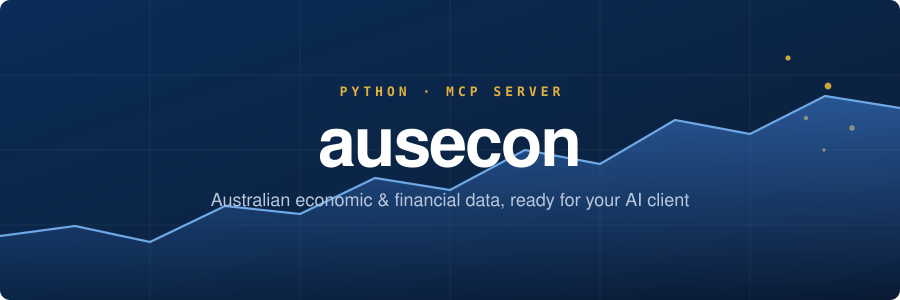

<!-- mcp-name: io.github.AnthonyPuggs/ausecon-mcp-server -->

<div align="center">



<br/>

[](https://github.com/AnthonyPuggs/ausecon-mcp-server/actions)
[](https://github.com/AnthonyPuggs/ausecon-mcp-server/actions/workflows/integration.yml)
[](https://pypi.org/project/ausecon-mcp-server/)
[](https://pypi.org/project/ausecon-mcp-server/)
[](#connect-your-client)
[](LICENSE)
[](https://smithery.ai/servers/anthonypuggs/ausecon-mcp)

[](https://glama.ai/mcp/servers/AnthonyPuggs/ausecon-mcp-server)
<p>
  <b>ausecon</b> is a Model Context Protocol server that gives an AI assistant structured access
  to Australia&rsquo;s official economic and financial data, straight from the ABS, RBA, and APRA.
</p>

<p>
  Open source, free, and no API key. Every series comes back fresh &amp; fully source-traceable,
  and all three sources share one response shape.
</p>

<a href="https://auseconmcp.com"><b>Documentation</b></a> &nbsp;·&nbsp;
<a href="https://auseconmcp.com/getting-started">Getting started</a> &nbsp;·&nbsp;
<a href="https://auseconmcp.com/tools">Tool reference</a> &nbsp;·&nbsp;
<a href="https://github.com/AnthonyPuggs/ausecon-mcp-server/blob/main/CHANGELOG.md">Changelog</a>

</div>

---

## Why this exists

Australian economic data is authoritative but awkward to reach. It sits behind three different
portals with three different formats, and each one expects you to already know its identifiers.
ausecon puts that data in front of an AI assistant with nothing to sign up for and no key to manage.
Every series is fetched from the source, cached for up to an hour, stamped with when it was actually
retrieved, and returned in the same `metadata · series · observations` shape whether it came from
the ABS, the RBA, or APRA. Ask for
"the cash rate" or "quarterly real GDP growth" and the assistant works out the right call.

<table align="center">
  <tr>
    <td align="center"><b>14</b><br/><sub>read-only tools</sub></td>
    <td align="center"><b>83</b><br/><sub>economic concepts</sub></td>
    <td align="center"><b>16</b><br/><sub>derived indicators</sub></td>
    <td align="center"><b>8</b><br/><sub>prompt templates</sub></td>
    <td align="center"><b>3</b><br/><sub>data sources</sub></td>
  </tr>
</table>

## What you get

<table>
  <tr>
    <td width="33%" valign="top">
      <h4>Fresh &amp; source-traceable</h4>
      Every value is fetched from the source, cached for up to an hour, and stamped with its
      provenance (<code>retrieved_at</code>, <code>source</code>, <code>server_version</code>). If a
      source is down after the cache expires, the old copy is returned flagged <code>stale</code>
      and never served silently.
    </td>
    <td width="33%" valign="top">
      <h4>Three sources, one shape</h4>
      ABS, RBA and APRA all return the same
      <code>metadata · series · observations</code> structure, so anything written against one
      source works for the other two.
    </td>
    <td width="33%" valign="top">
      <h4>Transparent derived series</h4>
      Formula-based indicators like <code>real_cash_rate</code>, with the formula and its input
      series returned alongside the numbers.
    </td>
  </tr>
  <tr>
    <td width="33%" valign="top">
      <h4>Source-native control</h4>
      Drop down to <code>get_abs_data</code>, <code>get_rba_table</code> or
      <code>get_apra_data</code> when you need a specific dataflow, table, or series ID.
    </td>
    <td width="33%" valign="top">
      <h4>Convenience tools</h4>
      Latest observations, top movers, and the release calendar, each in a single call.
    </td>
    <td width="33%" valign="top">
      <h4>Works with your client</h4>
      Claude Desktop, Claude Code, Cursor, Windsurf, VS Code, Codex or Smithery.
      stdio locally, Streamable HTTP when hosted.
    </td>
  </tr>
</table>

## Data sources

| Source | Coverage |
| :----- | :------- |
| **ABS** &nbsp;·&nbsp; Australian Bureau of Statistics | National accounts, prices, labour force, population |
| **RBA** &nbsp;·&nbsp; Reserve Bank of Australia | Cash rate, monetary & financial aggregates, exchange rates |
| **APRA** &nbsp;·&nbsp; Aust. Prudential Regulation Authority | ADI & insurer statistics, with release-cadence estimates |

## Try it instantly (no install)

A hosted read-only, no-API-key instance speaks MCP over Streamable HTTP at:

```text
https://mcp.auseconmcp.com/mcp
```

Point any MCP client that supports remote servers at that URL. In Claude Code:

```bash
claude mcp add --transport http ausecon https://mcp.auseconmcp.com/mcp
```

> The hosted instance may take a few seconds to wake on the first request. The previous
> `https://ausecon-mcp-server.onrender.com/mcp` URL continues to work and points at the
> same instance.

## Install

The package lives on [PyPI](https://pypi.org/project/ausecon-mcp-server/) and is meant to be
launched on demand by your MCP client through [`uvx`](https://docs.astral.sh/uv/):

```bash
uvx ausecon-mcp-server
```

The server speaks MCP over standard input and output. Run on its own it just sits there waiting
for a client, so there is nothing to see until one connects.

## Connect your client

<details open>
<summary><b>Claude Code</b></summary>

```bash
claude mcp add --transport stdio ausecon -- uvx ausecon-mcp-server
```
</details>

<details open>
<summary><b>Codex</b></summary>

```bash
codex mcp add ausecon -- uvx ausecon-mcp-server
```
</details>

<details>
<summary><b>Claude Desktop</b></summary>

Add to your `claude_desktop_config.json`:

```json
{
  "mcpServers": {
    "ausecon": {
      "command": "uvx",
      "args": ["ausecon-mcp-server"]
    }
  }
}
```
</details>

<details>
<summary><b>Cursor</b></summary>

Add to `~/.cursor/mcp.json` (global) or `.cursor/mcp.json` (project):

```json
{
  "mcpServers": {
    "ausecon": {
      "command": "uvx",
      "args": ["ausecon-mcp-server"]
    }
  }
}
```

Or paste this one-click link into your browser:

```text
cursor://anysphere.cursor-deeplink/mcp/install?name=ausecon&config=eyJjb21tYW5kIjoidXZ4IiwiYXJncyI6WyJhdXNlY29uLW1jcC1zZXJ2ZXIiXX0=
```
</details>

<details>
<summary><b>Windsurf</b></summary>

Add to `~/.codeium/windsurf/mcp_config.json`:

```json
{
  "mcpServers": {
    "ausecon": {
      "command": "uvx",
      "args": ["ausecon-mcp-server"],
      "env": {}
    }
  }
}
```
</details>

<details>
<summary><b>VS Code</b></summary>

[](https://insiders.vscode.dev/redirect/mcp/install?name=ausecon&config=%7B%22command%22%3A%22uvx%22%2C%22args%22%3A%5B%22ausecon-mcp-server%22%5D%7D)

Or add to `.vscode/mcp.json` (workspace) or your user `mcp.json`:

```json
{
  "servers": {
    "ausecon": {
      "type": "stdio",
      "command": "uvx",
      "args": ["ausecon-mcp-server"]
    }
  }
}
```
</details>

> To host it yourself, `smithery.yaml` and `Dockerfile.smithery` ship a Streamable HTTP
> deployment at `/mcp`. See the [Smithery guide](https://auseconmcp.com/smithery).

## A quick taste

Find the concept you want, then ask for the series:

```python
list_economic_concepts(query="cash rate")

get_economic_series(
    concept="cash_rate_target",
    start="2020-01-01",
)
```

Derived indicators have their own tool:

```python
get_derived_series(concept="real_cash_rate", last_n=12)
```

> Connected to an AI agent, you can skip the syntax entirely. Ask for "quarterly real GDP
> growth" and it works out which tools to call.

## Develop locally

Python 3.12 is recommended; the CI matrix supports 3.10+.

```bash
uv sync --python 3.12
uv run pytest
uv run ruff check src tests scripts
```

The repo also ships a manual benchmark (`evals/`) that measures the server's impact on model
answers across 52 Australian-economics questions, comparing a bare model, web search, and the
ausecon tools. Ground-truth resolution is free to check:

```bash
uv run --group evals python -m evals.run_eval --dry-run
```

A full run makes paid API calls, so read the
[evaluation harness guide](https://auseconmcp.com/maintainers/evaluation/) before starting one.

---

<div align="center">
<sub>

[auseconmcp.com](https://auseconmcp.com) &nbsp;·&nbsp;
[Issues](https://github.com/AnthonyPuggs/ausecon-mcp-server/issues) &nbsp;·&nbsp;
MIT Licence

</sub>
</div>
